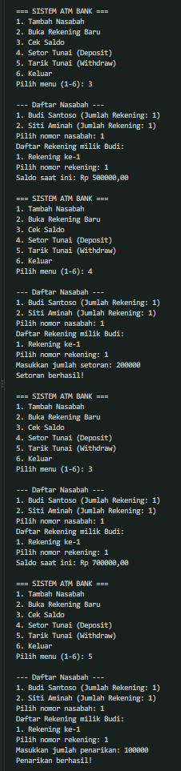

# Tugas Eksplorasi Array & ArrayList

Tugas latihan/eksplorasi materi Array dan ArrayList pada mata kuliah Pemrograman Berbasis Objek (PBO).

## 📂 File Program
- `Account.java` : Mengelola saldo, deposit, dan penarikan tunai.
- `Customer.java` : Mengelola nama nasabah dan daftar rekening (`ArrayList<Account>`).
- `Bank.java` : Mengelola daftar nasabah (`ArrayList<Customer>`).
- `Main.java` : Menu ATM interaktif menggunakan Scanner.

## 📷 Output Program
